# Board Game Cafe

*Hello! *
*Thank you for stopping by! Are you wondering what this is? well great question! *
*This is Sip & Play boardgame cafe webpage designed during the Codedex Summer Hackathon! *

The deployment site doesn't work at the current moment however we've provided our READ.md file with the images from our site.

### :computer:	Sip & Play boardgame website is built with:
- 
- 
- 
- 
- 

### :clipboard: Goals for Sip & Play Site:
- [x] Use real-time data stored in json files
- [x] Using React and bootstrap to design an develop web app platform
- [x] Creating User friendly UX/UI design
- [x] Creating a responsive Site

### :clipboard: Sip & Play Site Future Goals:
The future of this boardgame cafe site is currently uncertain... However I plan to develop better functionalities and complete all pages on this site. So far most features don't have the proper text and info nessessary to run this plateform which will also be included in the next steps. 
Some Future Goals However are:
- [ ] Using MongoDB as way to store info
- [ ] Better UX/UI design
- [ ] Creating Admin login and having an Admin friendly UX/UI design of plateform

### :clipboard: Boardgame Website Credits:
All images and photos are documented in Json Files and any 3D models used have been giving by the Codedex team via Notion.

### [Sip & Play](https://nightingalex03.github.io/board-game-cafe/)

### Site Responsiveness: 
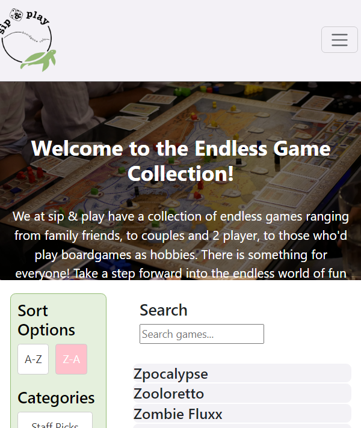
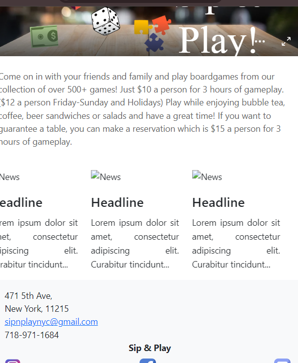
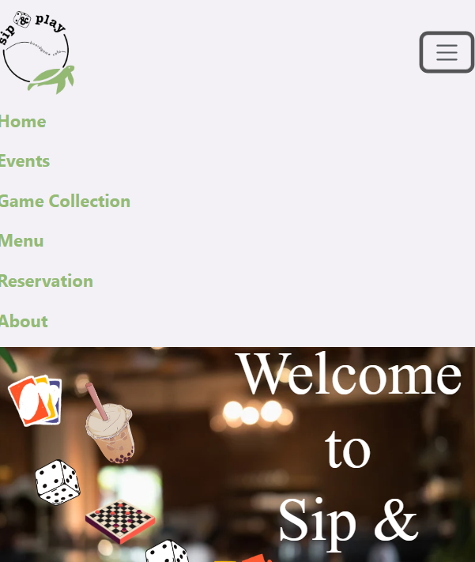

### Home

- Users can get to this page from any part of the website by clicking on the logo on the navbar
- Get info from actual site https://www.sipnplaynyc.com/ 
- Provides a button to the reservation page
- displays hours, location on embeded map and socials 
- Also provides a access point towards teh Calendar Events Page

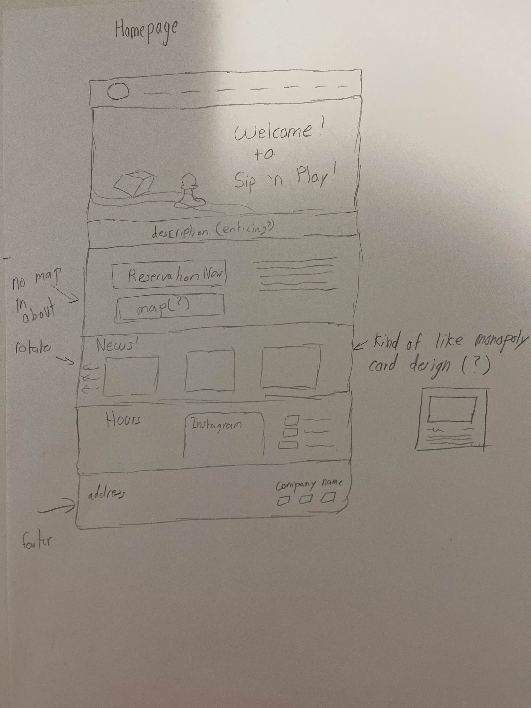
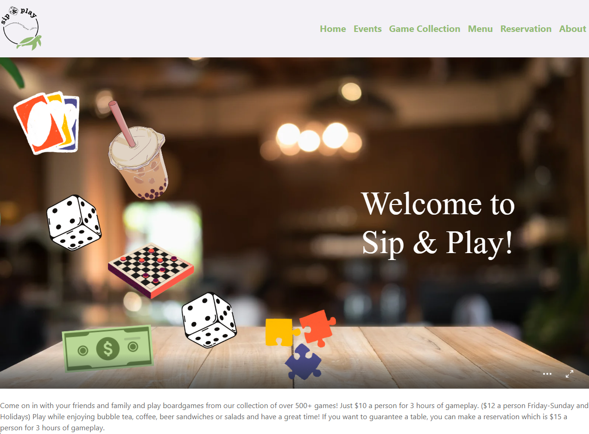
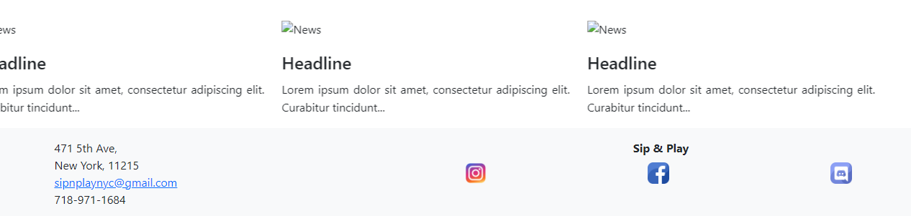

### Events

- Get the events info and display it in Calendar Format
- Each Event is clickable displaying a popup with event info and reservation link

### Game Collection

- Use a csv reader to read spreadsheet and display them on the site
- Search Bar to enable easy navigation through boardgame list
- Has different Filter options: A - Z, Z - A, Staff Picks for Families, Staff Picks for couples/2 player, Staff Picks for Hobbyists

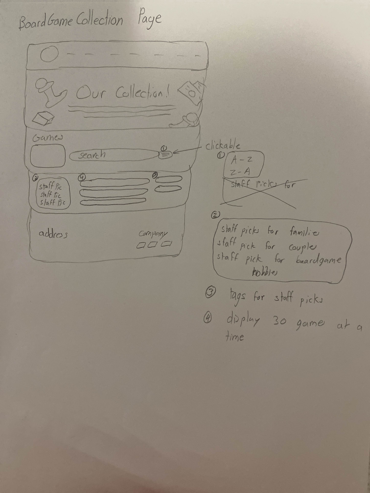
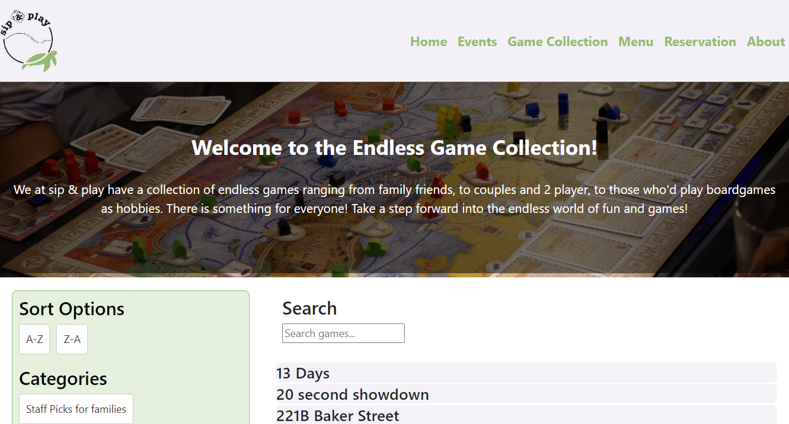
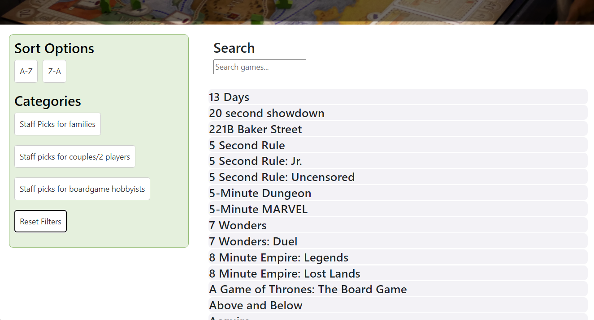
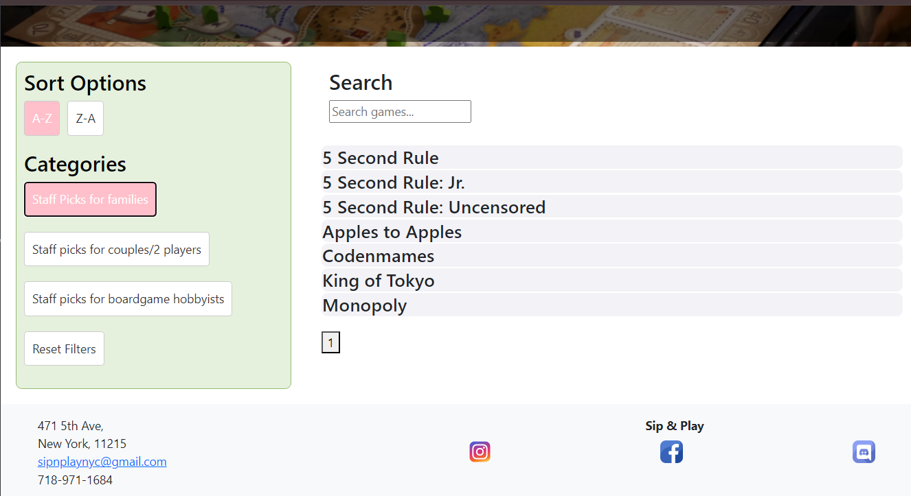
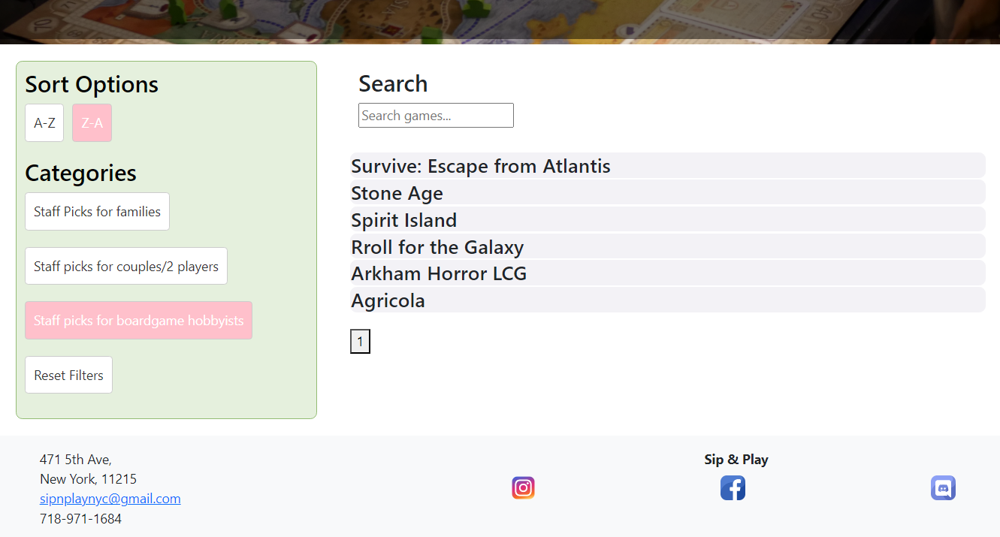
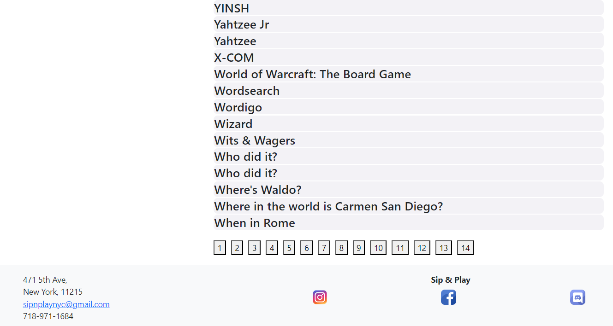

### Menu

Click on each item on the menu to learn more about it and the pricing.

- Use 3d assets for food items
- Categorize into the same sections from actual website
- Creating an engaging UX/UI design with viabrant colors to catch Users Interest

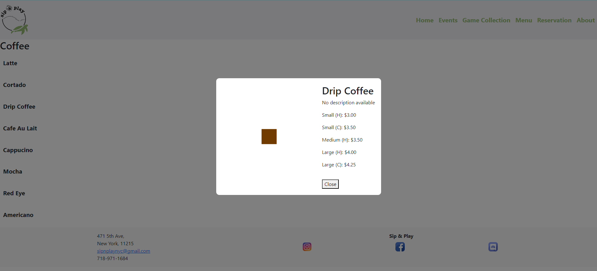

### Reservations

Leads to a separate reservations page and gift card buying page. Can look through the different birthday package options using the carousel view

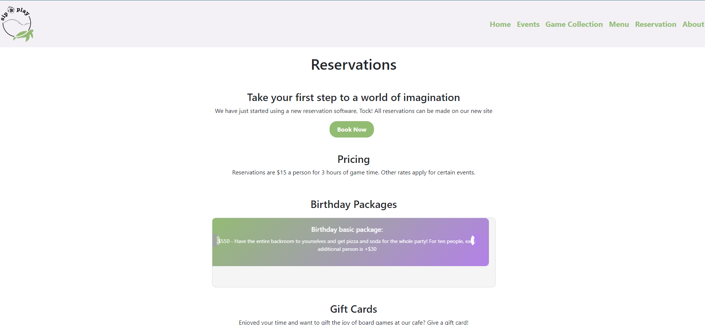

### About

- Details about page (get from actual website)
- Displays Hours and contact Information
- Embeded Map Location

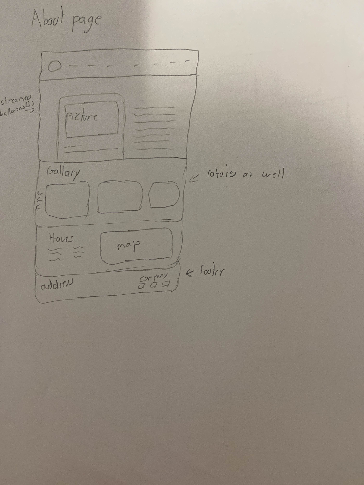
