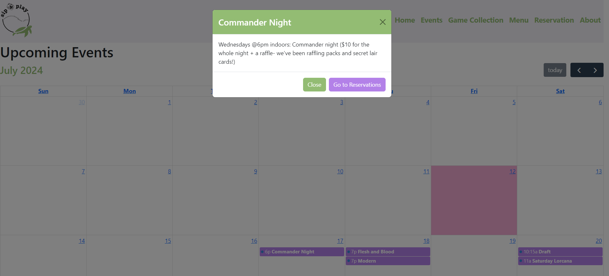

# Board Game Cafe

*Hello! *
*Thank you for stopping by! Are you wondering what this is? well great question! *
*This is Sip & Play boardgame cafe webpage designed during the Codedex Summer Hackathon! *

### :computer:	Sip & Play boardgame website is built with:
- 
- 
- 
- 
- 

### :clipboard: Goals for Sip & Play Site:
- [x] Use real-time data stored in json files
- [x] Using React and bootstrap to design an develop web app platform
- [x] Creating User friendly UX/UI design

### :clipboard: Sip & Play Site Future Goals:
The future of this boardgame cafe site is currently uncertain... However I plan to develop better functionalities and complete all pages on this site. So far most features don't have the proper text and info nessessary to run this plateform which will also be included in the next steps. 
Some Future Goals However are:
- [ ] Using MongoDB as way to store info
- [ ] Better UX/UI design
- [ ] Creating Admin login and having an Admin friendly UX/UI design of plateform

### :clipboard: Boardgame Website Credits:
All images and photos are documented in Json Files and any 3D models used have been giving by the Codedex team via Notion.

### [Sip & Play](https://nightingalex03.github.io/board-game-cafe/)

### Events

Created a calendar. Click on an event to see more information about the event and a link to reserve a spot for the event.

### Game Collection

Redesigned the game collection website turning the spreadsheet into an actual page! Users can look through all the games offered at the cafe. They can also sort the games and see different categories such as staff picks.

### Menu

Click on each item on the menu to learn more about it and the pricing.

### Reservations

Leads to a separate reservations page and gift card buying page. Can look through the different birthday package options using the carousel view

### Home

Displays all the info on the home page like hours, social media, news etc...

### About

Displays details about the cafe

This section has moved here: [https://facebook.github.io/create-react-app/docs/troubleshooting#npm-run-build-fails-to-minify](https://facebook.github.io/create-react-app/docs/troubleshooting#npm-run-build-fails-to-minify)
